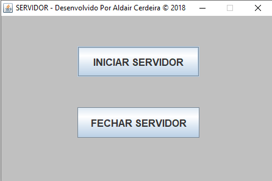

# Chat de mensagem cliente/servidor feito em Java

- Curso:  Ciência da computação	  
- 4ª período	1ª semestres de 2018
- Trabalho de atividades pratica supervisionadas – APS

``Sistema construído em Java  8``

## Apresentação do sistema

